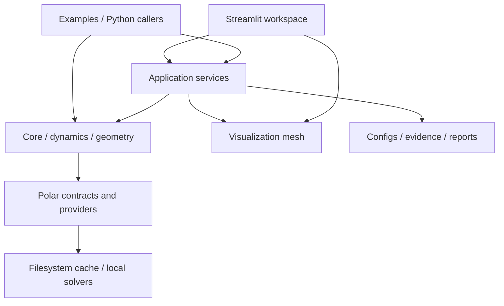

# Architecture, data and critical flows

Code baseline: `ca81d2d2b19622d65453e269d7bfcb48e70aec32` (GEOM-04, PR #63),
inspected 2026-09-17. See [current state](../agent/current-state.md) for maturity
and [decisions](decisions.md) for constraints. Paths below are repository-relative;
implementation paths beginning `core/`, `application/`, `geometry/`, `dynamics/`
or `visualization/` are under `pyfoldable/`.

## Product model and runtime

Researchers and engineers edit propeller geometry, inspect folding, run bounded
numerical studies and compare evidence before design decisions. Targets are
250 mm open / 140 mm stowed and at least 0.85 thrust retention at 7100 RPM against
a matched same-diameter reference; these are not achieved measurements. The
254 mm UIUC benchmark is a different reference. Evidence:
`configs/designs/TIP_HINGED_250_CANONICAL.toml`, `core/measurement_comparison.py`,
[validation roadmap](../validation_and_development_roadmap.md).

One setuptools distribution contains `pyfoldable` and the bundled `pythrust`
compatibility package. Python >=3.10; NumPy/SciPy core, optional Matplotlib,
Streamlit/Plotly and NeuralFoil. `pyproject.toml` is the dependency authority.
No JavaScript frontend workspace, SQL/ORM layer, hosted API or deployment stack
is configured. Streamlit invokes Python services synchronously.

## Dependency map

This is a responsibility map, not a package-enforced DAG. `core/polar_config.py`
constructs concrete providers lazily; clearance depends on visualization mesh
semantics. The UI also imports domain value types.

| Subsystem / interface | Inputs, owned data and consumers | Invariants / regression anchors |
| --- | --- | --- |
| `core/config.py::load_design_config`, `models.py`, `units.py` | TOML → SI `PropellerDesign` → services/kernels | Strict schema and finite values; `tests/core/test_config.py`, `test_models.py`, `test_units.py` |
| `core/providers.py`, `providers/xfoil.py`, `providers/neuralfoil.py`, `core/polar_orchestration.py` | Coordinate/request identity → local backend → results, attempts and health → family generation | Capabilities, bounded retries, partial-result policy; `tests/providers/`, `tests/core/test_polar_orchestration.py` |
| `core/polar_cache*.py`, `polar_health.py` | Request/provider keys → atomic JSON, process locks, process-local health | Cache/lock failures are not solver success; `tests/core/test_polar_cache*.py`, `test_polar_health.py` |
| `core/polar_family_generation.py`, `polar_analysis.py`, `bem*.py`, `foldable_rotor.py` | Tables/families + stations → section/rotor loads and diagnostics | Section integration differs from BEM; domain/branch/coverage explicit; corresponding `tests/core/test_*.py` |
| `core/motor_bem_coupling.py`; `dynamics/` | Motor/BEM equilibrium; separately legacy dynamics and PY-05 prescribed histories | Electrical vs shaft power; PY-05 terminal first contact and no BEM feedback; `test_motor_bem_coupling.py`, `tests/dynamics/test_mechanism_transient*.py` |
| `application/design_draft.py`, `design_analysis.py`, `active_design_search.py`, `geometry_search.py` | Session draft + explicit sources → bounded preparation/run/search → artifacts | Rehash/reparse, explicit run, unknown constraints cannot select; corresponding `tests/application/test_*.py` |
| `geometry/triangle_distance.py`, `surface_clearance.py`, `hardware.py`; `application/surface_clearance.py` | Retained surfaces/optional solids + synchronous interval → distance bounds, witnesses, ledger | Exact predicates, outward bounds, budgets/exclusions; `tests/geometry/`, `tests/application/test_surface_clearance_service.py`, `test_hardware_clearance_motion.py` |
| `core/experiment_contract.py`, `fea_contract.py`, `measurement_comparison.py`, `motor_rotor_correlation.py`, `mechanism_observation.py` | Manifests, runs, calibration and observations → comparisons and acceptance records | Matched revision/run/condition, uncertainty, no target fitting; corresponding core tests |
| `application/dashboard.py`, `evidence_import.py`; `apps/pyfoldable_dashboard.py` | Archive + session inputs → Turkish workspace, diagnostics/downloads | Manifest/evidence agreement, session-only imports, invalidation; dashboard/import tests and `tests/ui/` |
| `pyfoldable/models.py`, `integration.py`, `performance.py`; `pythrust/` | Legacy JSON/CSV and reference operating points → V1/V2 outputs | Distinct models/conventions; `tests/test_integration.py`, `test_reference_scaled_thrust.py`, `tests/dynamics/` |

Short filenames in each table row share the preceding directory. Test filenames
without a full prefix share that row's preceding test directory.

## Conceptual data model

No database schema, migration, trigger, generated ORM type or row-level
authorization exists. Ownership here means code responsibility, not user/tenant
access. Dataclasses and versioned TOML/JSON contracts are the data model.

| Entity / owner | Relationships and lifecycle | Invariant |
| --- | --- | --- |
| `PropellerDesign` / `core/models.py` | Contains blade stations, airfoils, hinge and conditions; optional motor/material/manufacturing and validation records | SI conversion; optional metadata is not measured material evidence |
| `DesignDraftArtifact` / `application/design_draft.py` | Active inputs → round-tripped TOML/hash → preview/services/export; replaced on edit | One applied draft supplies geometry; canonical config is unchanged |
| `StationBundle` / `application/blade_stations.py` | Raw/canonical digests + provenance bind stations to diameter, hub and profile | Explicit apply/rebind; incomplete span stays incomplete; no silent physical scaling |
| Polar request/result, table/family / `core/providers.py`, `models.py`, `polar.py` | Coordinates + backend/settings → result/cache → accepted table → explicit Cartesian family | Profile identity and supported domain; sparse successes are not a complete family |
| `HardwareBundle` / `application/hardware_contract.py` | Source + raw/canonical JSON → named hub/root/tip bodies → convex solids/cylinder envelopes | Body-local frames, one-based blade IDs, topology and hub identity; declaration is not authentication |
| `SurfaceClearanceRequest` / `application/surface_clearance.py` | Exact draft + controls + hardware → request digest → pair/interval report | Budget/precision exhaustion stays unknown; retained-surface and full-propeller scope differ |
| Mechanism request/binding / `application/mechanism_transient.py`, `mechanism_binding.py` | Declared drive, mass samples and draft → history → optional observation comparison | Prescribed drive, explicit friction, terminal first contact; comparison is not fitting |
| `TestStandManifest`, run/summary/decision / `core/experiment_contract.py` | Calibration/policy + raw run → uncertainty summary → decision → matched comparison | Manifest/run/summary digests, calibration dates, conditions; PY-06A requires v2 decision identity |
| FEA manifest / `core/fea_contract.py` | CAD revision + material + load cases → assessed result contract | No inferred material limits, automatic ANSYS execution or structural qualification |
| Dashboard/run/import artifacts / `application/` | Versioned files or inspected session bytes → render/export; clear on input identity changes | Upload success does not promote project gates |

Dashboard `EvidenceState` uses `qualified`, `screening_only`, `pending`, `failed`,
`blocked`; geometry also uses `unknown` and contact states. These are different
contracts, not one Boolean validation flag. Hashes bind content, not authenticity.

## Critical flows and side effects

1. **Workspace:** `main()` → `load_dashboard_snapshot()` → dashboard TOML →
   contained design/report paths → hash/decision checks → overview. No database
   or application network call; inconsistent evidence fails closed.
   Anchor: `tests/application/test_dashboard.py`.
2. **Geometry editing:** `_render_design_geometry()` → durable session controls
   and staged station rows → explicit apply → `build_design_draft()` → canonical
   parser → mesh/export. Temporary parser files are cleaned up; canonical files
   are not saved. Changes clear dependent downloads. Anchors:
   `tests/ui/test_geometry_navigation_ui.py`, `test_blade_stations_ui.py`.
3. **Active BEM:** polar upload → `application/polar_upload.py` identity checks →
   explicit run → `run_design_analysis()` or `run_active_search()` → strict BEM →
   session report/download. First condition, fully open supported geometry,
   single matching profile and declared station span only. No automatic external
   provider or benchmark substitution. Anchors: `tests/application/test_design_analysis.py`,
   `tests/ui/test_active_design_polar_ui.py`, `test_active_search_ui.py`.
4. **Clearance:** draft + exclusions + optional hardware →
   `prepare_surface_clearance()` → explicit action → `run_surface_clearance()` →
   mesh/BVH and metered narrow phase → interval/witness report. Unvisited work
   stays unknown. Candidate search is separate. Anchors:
   `tests/ui/test_surface_clearance_ui.py`, `test_geom04_hardware_ui.py`.
5. **Mechanism/measurement:** declared drive + optional draft binding → preparation
   → explicit PY-05 run → terminal-contact history. Separate Python comparison
   APIs validate PR-10 or PY-06D1 observations. Combined comparison UI is not
   shipped. Anchors: `tests/ui/test_bound_mechanism_ui.py`,
   `tests/core/test_mechanism_observation.py`, `test_measurement_comparison.py`.
6. **Provider evidence:** trusted CLI/config → lazy runtime → capability/cache/
   health policy → local solver → validated result → atomic cache/family/report.
   Dedicated CI captures real-backend bundles, compares independent runs and
   checks the explicitly promoted baseline. Unit-test doubles do not replace this.
   See [real-backend qualification](../polar_real_backend_qualification.md).

No background queue, broker, payment/email integration or analytics service is
implemented. Streamlit supplies its transport; there is no application-specific
realtime protocol. Observability consists of report diagnostics, attempt/health
records and CI artifacts, not a centralized telemetry deployment.

## High-risk coupling

- The roughly 2,000-line dashboard owns many state keys. Review navigation,
  upload persistence and stale downloads together (`test_geometry_navigation_ui.py`).
- Clearance depends on visualization mesh partitioning, hinge frames and
  exclusions. A station/mesh edit can change numerical meaning even if visually
  small (`application/surface_clearance.py`, `visualization/propeller_25d.py`).
- Services reuse private parsing/identity helpers from `application/design_analysis.py`.
  Refactors affect searches and mechanism binding; do not duplicate their logic.
- `application/analysis_run.py` defaults to repository fixtures/reports. A source
  checkout is the tested workspace layout; the wheel does not contain the entire
  workspace (`pyproject.toml` package discovery/data).
- Exact arithmetic, rounding margins, cache locking, evidence matching and public
  model validation need focused regressions. Exact triangle predicates do not
  make every rotated mesh/interval result a physically certified conclusion.
